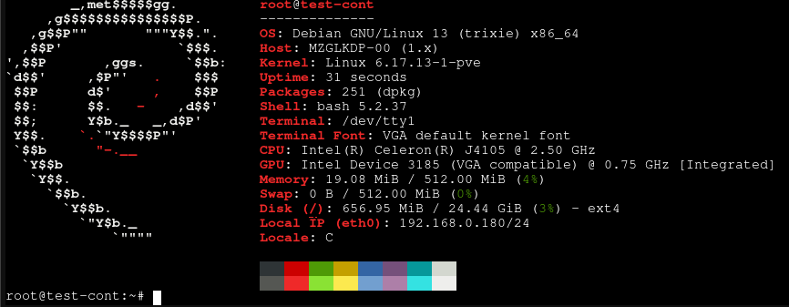

# Instalācija
1. Instalēts "Proxmox Virtual Environment" 9.1.6 uz ierīces

Ierīces specifikācija:
- CPU: Intel Celeron J4105 (4) @ 2.50 GHz
- RAM: 8GB DDR4
- Disks: 250 GB SSD

# LXC konteiners un SSH atslēga

2. Lejupielādēta Debian 13 LXC konteinera veidne

3. Izveidots Debian 13 LXC konteiners:
- 1 kodols
- 512 MB RAM
- 25 GB Atmiņa
- Privileģēts konteiners

4. Pievienota publiska SSH atslēga Debian konteineram un Proxmox VE

5. Instalēta "Ansible" pakotne Debian konteinerā
